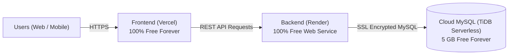

# 🚀 100% FREE FOREVER Hosting Guide (No Credit Card Required)

> [!NOTE]
> Railway only gives a **30-day / $5 one-time trial**, and requires a paid subscription after that.
> **This guide uses a 100% Free Forever stack with ZERO credit card required:**
> - 🗄️ **Database**: **TiDB Serverless** (Free 5 GB MySQL forever, no credit card)
> - ⚙️ **Backend**: **Render** (Free Web Service forever, 750 free hours/month, no credit card)
> - 🎨 **Frontend**: **Vercel** (Free forever, unlimited hobby deployments, no credit card)

---

## 📋 The 100% Free Architecture



---

## 🗄️ Step 1: Create Free Cloud MySQL on TiDB (5 GB Free Forever)

**TiDB Serverless** provides a fully MySQL-compatible database with 5 GB free storage forever and requires **no credit card**.

1. Go to [pingcap.com/tidb-serverless](https://www.pingcap.com/tidb-serverless/) and sign up with your **GitHub** or Google account.
2. Click **Create Cluster** → Choose **Serverless (Free)**.
3. Once the cluster is active (takes ~15 seconds), click **Connect** on the top right.
4. Select **Connect with: Node.js / MySQL2** or **General**.
5. Copy your connection details:
   - **Host**: (e.g. `gateway01.us-east-1.prod.aws.tidbcloud.com`)
   - **Port**: `4000`
   - **User**: (e.g. `xxxxxxxx.root`)
   - **Password**: *(click 'Generate Password' and copy)*
   - **Database**: `test` (or create your own database name like `family_expense_tracker`)
6. Open the **SQL Editor** tab directly in the TiDB Web Console.
7. Paste and run the initialization script below:

### 📋 Database Tables SQL Script (Copy & Run in TiDB SQL Editor)

```sql
CREATE DATABASE IF NOT EXISTS family_expense_tracker;
USE family_expense_tracker;

-- 1. Users Table
CREATE TABLE IF NOT EXISTS users (
    user_id INT AUTO_INCREMENT PRIMARY KEY,
    email VARCHAR(255) NOT NULL UNIQUE,
    password_hash VARCHAR(255) NOT NULL,
    name VARCHAR(255) NOT NULL,
    access_key VARCHAR(50) UNIQUE,
    avatar_index INT DEFAULT NULL,
    reset_otp VARCHAR(10) DEFAULT NULL,
    reset_otp_expires DATETIME DEFAULT NULL,
    created_at TIMESTAMP DEFAULT CURRENT_TIMESTAMP
);

-- 2. Circles Table
CREATE TABLE IF NOT EXISTS circles (
    circle_id INT AUTO_INCREMENT PRIMARY KEY,
    name VARCHAR(255) NOT NULL,
    family_code VARCHAR(50) NOT NULL UNIQUE,
    created_by INT,
    created_at TIMESTAMP DEFAULT CURRENT_TIMESTAMP,
    CONSTRAINT fk_circles_created_by FOREIGN KEY (created_by) REFERENCES users (user_id) ON DELETE SET NULL
);

-- 3. Members Table
CREATE TABLE IF NOT EXISTS members (
    member_id INT AUTO_INCREMENT PRIMARY KEY,
    circle_id INT NOT NULL,
    user_id INT,
    name VARCHAR(255) NOT NULL,
    role ENUM('ADMIN', 'MEMBER') DEFAULT 'MEMBER',
    access_key VARCHAR(50),
    is_active BOOLEAN DEFAULT TRUE,
    created_at TIMESTAMP DEFAULT CURRENT_TIMESTAMP,
    CONSTRAINT fk_members_circle FOREIGN KEY (circle_id) REFERENCES circles (circle_id) ON DELETE CASCADE,
    CONSTRAINT fk_members_user FOREIGN KEY (user_id) REFERENCES users (user_id) ON DELETE SET NULL,
    CONSTRAINT uk_circle_user UNIQUE (circle_id, user_id)
);

-- 4. Categories Table
CREATE TABLE IF NOT EXISTS categories (
    category_id INT AUTO_INCREMENT PRIMARY KEY,
    name VARCHAR(100) NOT NULL
);

INSERT IGNORE INTO categories (category_id, name) VALUES
(1, 'Groceries & Food'),
(2, 'Electricity & Utilities'),
(3, 'Rent & Housing'),
(4, 'Transportation & Fuel'),
(5, 'Entertainment & Dining'),
(6, 'Healthcare & Medical'),
(7, 'Miscellaneous');

-- 5. Expenses Table
CREATE TABLE IF NOT EXISTS expenses (
    expense_id INT AUTO_INCREMENT PRIMARY KEY,
    circle_id INT NOT NULL,
    amount DECIMAL(10, 2) NOT NULL,
    category_id INT NOT NULL,
    paid_by INT NOT NULL,
    expense_date DATE NOT NULL,
    description VARCHAR(255),
    split_type ENUM('EQUAL', 'CUSTOM') DEFAULT 'EQUAL',
    created_at TIMESTAMP DEFAULT CURRENT_TIMESTAMP,
    CONSTRAINT fk_expenses_circle FOREIGN KEY (circle_id) REFERENCES circles (circle_id) ON DELETE CASCADE,
    CONSTRAINT fk_expenses_category FOREIGN KEY (category_id) REFERENCES categories (category_id),
    CONSTRAINT fk_expenses_member FOREIGN KEY (paid_by) REFERENCES members (member_id)
);

-- 6. Expense Splits Table (With CASCADE cleanup)
CREATE TABLE IF NOT EXISTS expense_splits (
    split_id INT AUTO_INCREMENT PRIMARY KEY,
    expense_id INT NOT NULL,
    member_id INT NOT NULL,
    share_amount DECIMAL(10, 2) NOT NULL,
    CONSTRAINT fk_splits_expense FOREIGN KEY (expense_id) REFERENCES expenses (expense_id) ON DELETE CASCADE,
    CONSTRAINT fk_splits_member FOREIGN KEY (member_id) REFERENCES members (member_id)
);

-- 7. Settlements Table
CREATE TABLE IF NOT EXISTS settlements (
    settlement_id INT AUTO_INCREMENT PRIMARY KEY,
    circle_id INT NOT NULL,
    payer_id INT NOT NULL,
    receiver_id INT NOT NULL,
    amount DECIMAL(10, 2) NOT NULL,
    month INT NOT NULL,
    year INT NOT NULL,
    status ENUM('PENDING', 'CONFIRMED', 'REJECTED') DEFAULT 'PENDING',
    notes TEXT,
    created_at TIMESTAMP DEFAULT CURRENT_TIMESTAMP,
    confirmed_at TIMESTAMP NULL,
    CONSTRAINT fk_settle_circle FOREIGN KEY (circle_id) REFERENCES circles (circle_id) ON DELETE CASCADE,
    CONSTRAINT fk_settle_payer FOREIGN KEY (payer_id) REFERENCES members (member_id),
    CONSTRAINT fk_settle_receiver FOREIGN KEY (receiver_id) REFERENCES members (member_id)
);

-- 8. Circle Leave Requests Table
CREATE TABLE IF NOT EXISTS circle_leave_requests (
    request_id INT AUTO_INCREMENT PRIMARY KEY,
    circle_id INT NOT NULL,
    member_id INT NOT NULL,
    user_id INT NOT NULL,
    status ENUM('PENDING', 'APPROVED', 'REJECTED') DEFAULT 'PENDING',
    created_at TIMESTAMP DEFAULT CURRENT_TIMESTAMP,
    CONSTRAINT fk_clr_circle FOREIGN KEY (circle_id) REFERENCES circles (circle_id) ON DELETE CASCADE,
    CONSTRAINT fk_clr_member FOREIGN KEY (member_id) REFERENCES members (member_id) ON DELETE CASCADE,
    CONSTRAINT fk_clr_user FOREIGN KEY (user_id) REFERENCES users (user_id) ON DELETE CASCADE
);
```

---

## ⚙️ Step 2: Deploy Backend on Render (100% Free Forever)

**Render** gives you a free Web Service with 750 hours/month (enough to run 24/7 all month long) and requires **no credit card**.

1. Push your project code to **GitHub** (if you haven't already).
2. Go to [render.com](https://render.com/) and click **Sign Up with GitHub**.
3. On the dashboard, click **New +** → Select **Web Service**.
4. Choose **Build and deploy from a Git repository** → Select your repository.
5. Fill in the deployment settings:
   - **Name**: `family-expense-tracker-backend` (or any name you like)
   - **Region**: Choose the closest region (e.g., Singapore, Frankfurt, Oregon)
   - **Branch**: `sprint6Remainingfixes` (or your main branch)
   - **Root Directory**: `Backend`  *(important!)*
   - **Runtime**: `Node`
   - **Build Command**: `npm install`
   - **Start Command**: `node server.js`
   - **Instance Type**: Select **Free**
6. Scroll down to **Environment Variables** and click **Add Environment Variable**:
   | Variable Key | Value |
   | :--- | :--- |
   | `PORT` | `5000` |
   | `DB_HOST` | *(your TiDB host from Step 1)* |
   | `DB_PORT` | `4000` |
   | `DB_USER` | *(your TiDB user)* |
   | `DB_PASSWORD` | *(your TiDB password)* |
   | `DB_NAME` | `family_expense_tracker` *(or test)* |
   | `DB_SSL` | `true` *(required for TiDB)* |
   | `JWT_SECRET` | `family_tracker_super_secret_jwt_key_2026` |
   | `EMAIL_USER` | `yourgmail@gmail.com` *(System sender Gmail address)* |
   | `EMAIL_PASS` | `abcd efgh ijkl mnop` *(16-char Gmail App Password)* |

> [!TIP]
> ### 📧 How to get your free Gmail App Password (60 Seconds):
> `EMAIL_USER` is **NOT** the user logging in — it is your **System Sender Mailbox** that automatically sends OTP codes to any user who requests a password reset.
> 1. Go to your Google Account at [myaccount.google.com](https://myaccount.google.com/).
> 2. On the left menu, click **Security**.
> 3. Ensure **2-Step Verification** is turned **ON**.
> 4. Go to [myaccount.google.com/apppasswords](https://myaccount.google.com/apppasswords) (or type "App passwords" in the search box).
> 5. Enter an App Name (e.g., `Expense Tracker`) and click **Create**.
> 6. Google will generate a **16-character password** (e.g., `abcd efgh ijkl mnop`).
> 7. Copy this password and paste it into Render as `EMAIL_PASS` (and `EMAIL_USER` as your Gmail address).
> 8. Click **Save Changes** on Render. Real OTP emails will now arrive in your users' actual inboxes!

7. Click **Create Web Service** (or **Save Changes** if already created).
8. Render will deploy your backend in ~2 minutes. Once deployed, copy your public backend URL from the top of the page:
   `https://family-expense-tracker-backend.onrender.com`

---

## 🎨 Step 3: Deploy Frontend on Vercel (100% Free Forever)

**Vercel** gives you free, ultra-fast hosting for React applications with zero credit card required.

1. Go to [vercel.com](https://vercel.com/) and sign up / log in with **GitHub**.
2. Click **Add New...** → **Project**.
3. Find your repository and click **Import**.
4. In the **Configure Project** screen:
   - **Framework Preset**: `Create React App`
   - **Root Directory**: Click **Edit** and select `frontend`
5. Expand the **Environment Variables** section and add:
   - **Name**: `REACT_APP_API_URL`
   - **Value**: `https://family-expense-tracker-backend.onrender.com/api`
   *(Replace with your actual Render URL, making sure to include `/api` at the end!)*
6. Click **Deploy**!
7. Within 1 minute, Vercel will give you a live production URL:
   `https://family-expense-tracker.vercel.app`

> [!TIP]
> The `frontend/vercel.json` file is already in place. This guarantees that direct navigation or refreshing on `/dashboard` and `/add-expense` will never give a 404 error.

---

## ⚡ Step 4: Keep Render Awake (100% Free & Secure)

On Render's free tier, web services spin down to sleep after 15 minutes of inactivity. When you open the app, the first request may take ~30–45 seconds to wake up (cold start).

To keep it awake 24/7 without cold starts:
1. Go to [cron-job.org](https://cron-job.org/en/) (free forever).
2. Create a new cron job that sends a `GET` request every **10 minutes** to your dedicated health endpoint:
   ```
   https://family-expense-tracker-backend.onrender.com/api/health
   ```
   *(or `https://family-expense-tracker-backend.onrender.com/health`)*

> [!NOTE]
> **Why this endpoint is 100% safe & vulnerability-free:**
> - **Zero Database Overhead**: Operates entirely in-memory (`<1ms`), using 0 MySQL connections and 0 TiDB request units.
> - **No Sensitive Information Leaked**: Returns only generic status & uptime timestamps (no environment variables, DB credentials, or stack traces).
> - **Built-in Flood Guard**: Includes an automated in-memory rate limiter (max 60 req/min per IP) to prevent bot flooding.
> - **Anti-Cache Headers**: Sends `no-cache, no-store` headers so requests always hit Render's server and reset the idle timer.
> - **Optional Secret Key**: If you want complete isolation so *only* your cron job can ping it, add `HEALTH_CHECK_SECRET=your_secret_key` in Render's Environment Variables, and set the URL in cron-job.org to `https://.../api/health?key=your_secret_key`. If not set, it operates safely in open mode.

---

## 🏁 Summary of Free Credentials

| Service | Platform | Cost | Credit Card? |
| :--- | :--- | :--- | :--- |
| **Database** | TiDB Serverless (MySQL) | $0.00 (5 GB free forever) | ❌ Not required |
| **Backend** | Render Web Service | $0.00 (750 hrs/month free forever) | ❌ Not required |
| **Frontend** | Vercel | $0.00 (Unlimited free hobby tier) | ❌ Not required |
